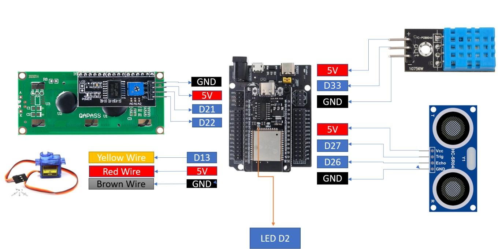
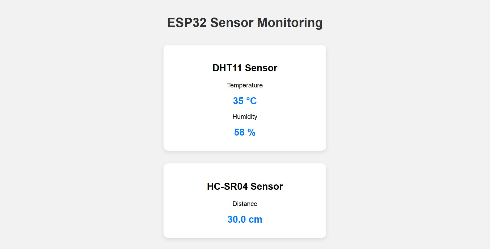
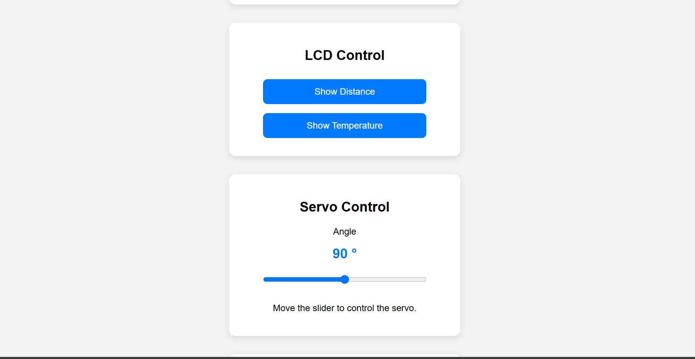
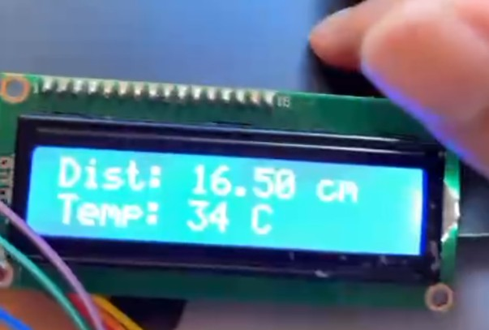
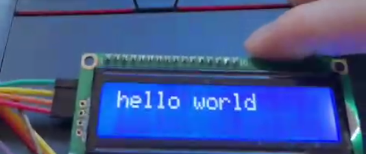

# Lab 2 – ESP32 IoT Web Dashboard (Sensors + LCD)

An ESP32 running MicroPython that hosts a small web server. From any browser on the same Wi-Fi network you can read temperature, humidity and distance, choose which readings appear on a 16x2 I2C LCD, and send custom text to the LCD.

Course: Introduction to Internet of Things – Lab 2 (Task 6: Documentation and Demonstration)

---

## Repository Contents

| File | Purpose |
|------|---------|
| `main.py` | Main program: Wi-Fi, web server, sensors, LCD control |
| `lcd_api.py` | LCD base API (helper) |
| `machine_i2c_lcd.py` | I2C LCD driver (helper) |
| `Lab2_Task1.py` – `Lab2_Task4.py` | Individual task versions (sensors, LCD buttons, servo, custom text) |
| `Lab2_Instructions.pdf` | Lab handout |
| `wiring_diagram.jpg` | Wiring diagram |

---

## Hardware

- ESP32 dev board (MicroPython firmware flashed)
- DHT11 temperature/humidity sensor
- HC-SR04 ultrasonic distance sensor
- 16x2 LCD with I2C backpack (address `0x27`)
- SG90 servo motor
- Breadboard, jumper wires, USB cable
- Laptop with Thonny, Wi-Fi access

## Wiring



| Component | Pin | ESP32 GPIO |
|-----------|-----|-----------|
| LCD (I2C) | SDA | 21 |
| LCD (I2C) | SCL | 22 |
| LCD (I2C) | VCC / GND | 5V / GND |
| DHT11 | Data | 33 |
| DHT11 | VCC / GND | 5V / GND |
| HC-SR04 | Trig | 27 |
| HC-SR04 | Echo | 26 |
| HC-SR04 | VCC / GND | 5V / GND |
| SG90 servo | Signal (yellow) | 13 |
| SG90 servo | VCC (red) / GND (brown) | 5V / GND |

> The HC-SR04 Echo pin outputs 5V. If your board is not 5V tolerant, use a voltage divider on the Echo line.

---

## Wi-Fi and Web Server Setup

1. **Flash MicroPython** onto the ESP32 and open the board in Thonny.
2. **Upload these files** to the ESP32 (File → Save as → MicroPython device):
   - `main.py`
   - `lcd_api.py`
   - `machine_i2c_lcd.py`
3. **Set your Wi-Fi credentials** near the top of `main.py`:
   ```python
   ssid = "YOUR_WIFI_NAME"
   password = "YOUR_WIFI_PASSWORD"
   ```
4. **Run the program** (or press the ESP32 reset button – `main.py` runs automatically on boot).
5. **Find the IP address** in the Thonny shell:
   ```
   Wi-Fi connected! IP address: http://192.168.x.x
   Web server is running...
   ```
6. **Open that address** in a browser on a phone or laptop connected to the **same Wi-Fi network**.

The LCD shows "IoT Class / Lab 2 & main.py" for 2 seconds at startup, then clears.

**Troubleshooting**
- *"Wi-Fi connection failed!"* – check the SSID/password; the ESP32 only supports 2.4 GHz networks.
- *LCD blank* – adjust the contrast potentiometer on the I2C backpack, and confirm the address is `0x27`.
- *"Sensor error" / "Out of range"* – recheck DHT11 and HC-SR04 wiring.

---

## Using the Web Page

The page (`ESP32 Sensor Monitoring`) has five sections:

### 1. DHT11 Sensor
Shows the current **temperature (°C)** and **humidity (%)**. Shows "Sensor error" if the reading fails.

### 2. HC-SR04 Sensor
Shows the current **distance (cm)**. Shows "Out of range" if no echo is received.

> Temperature, humidity and distance update automatically every 2 seconds, without reloading the page.

### 3. LCD Control
| Button | Action |
|--------|--------|
| **Show Distance** / **Hide Distance** | Toggles the distance on **LCD line 1** (`Dist: xx.x cm`) |
| **Show Temperature** / **Hide Temperature** | Toggles the temperature on **LCD line 2** (`Temp: xx C`) |

The button label switches between "Show" and "Hide" to reflect the current state. While a reading is shown, its LCD line updates with fresh values every 2 seconds.

### 4. Servo Control
Drag the slider (0–180°). The angle shown on the page updates as you drag, and the servo moves to that angle when you release the slider. The servo starts at 90° on boot.

### 5. Send Text to LCD
1. Type a message (up to 100 characters) in the textbox.
2. Click **Send**.
3. The status line shows "Message sent to LCD!" (or asks you to enter text if the box is empty).
4. Messages of **16 characters or fewer** display on LCD line 1. **Longer messages scroll** across the LCD.

> If Distance or Temperature is currently shown on the LCD, it will redraw over your message on the next 2-second update. Hide both first to keep a message on screen.

---

## Screenshots

| Web page | Description |
|----------|-----|
|  | Task 1&2 |
|  | Task 3 |
|  | Task 4 |

| LCD | Description |
|----------|-----|
|  |  |
|  | Task 3 |

## Demonstration Video

▶ [Watch the demo](https://youtube.com/shorts/VDjm2SJ5rjo)

The video shows: live temperature, humidity and distance readings; temperature and distance displayed on the LCD via the web buttons; servo control via the slider; and custom text sent from the browser to the LCD.

---

## How It Works (Short)

`main.py` connects to Wi-Fi, opens a socket server on port 80, and loops forever handling browser requests:

- `GET /` – reads the sensors and returns the HTML page.
- `GET /data` – returns the current readings as JSON; the page calls this every 2 seconds to update the values (and the LCD, if a reading is toggled on).
- `GET /?distance=toggle` and `GET /?temperature=toggle` – flip the LCD display flags, then return the page.
- `GET /servo?angle=N` – moves the servo to angle `N` (0–180).
- `GET /message?text=...` – URL-decodes the text and shows or scrolls it on the LCD.
