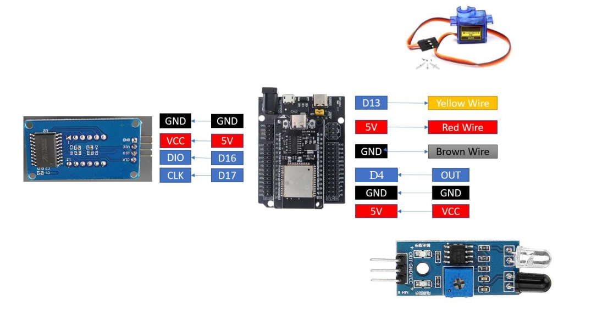
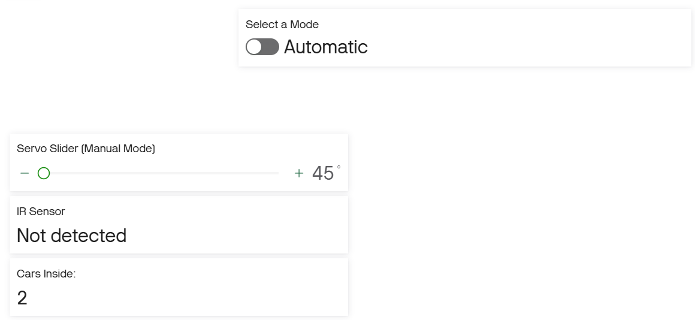
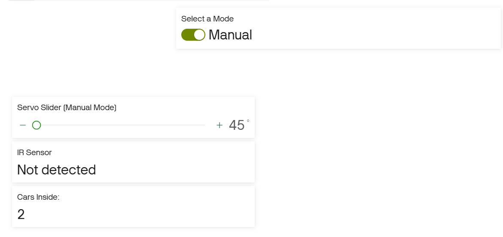

# Lab 3 – ESP32 Smart Gate with Blynk

An ESP32 running MicroPython that controls a servo-driven gate using an IR sensor and a Blynk dashboard. The gate can run on its own (**Automatic** mode) or be moved from a Blynk slider (**Manual** mode). Detections are counted on a TM1637 display and mirrored to Blynk.

---

## Repository Contents

| File | Purpose |
|------|---------|
| `main.py` | Main program: Wi-Fi, Blynk requests, IR sensor, servo, TM1637 counter, Automatic/Manual modes |
| `tm1637.py` | TM1637 4-digit display driver (helper) |
| `wiring_diagram.png` | Wiring diagram |
| `images/` | Blynk dashboard screenshots |

---

## Hardware

- ESP32 dev board (MicroPython firmware flashed)
- IR obstacle sensor module
- SG90 servo motor (the gate)
- TM1637 4-digit 7-segment display
- Breadboard, jumper wires, USB cable
- Laptop with Thonny, Wi-Fi access and a Blynk account

## Wiring



| Component | Pin | ESP32 GPIO |
|-----------|-----|-----------|
| IR sensor | OUT | 4 |
| IR sensor | VCC / GND | 5V / GND |
| SG90 servo | Signal (yellow) | 13 |
| SG90 servo | VCC (red) / GND (brown) | 5V / GND |
| TM1637 | DIO | 16 |
| TM1637 | CLK | 17 |
| TM1637 | VCC / GND | 5V / GND |

---

## Wi-Fi and Blynk Setup

### 1. Blynk datastreams

Create a template in Blynk Console with these four datastreams, then add a device from the template.

| Virtual Pin | Name | Data type | Range | Used for |
|-------------|------|-----------|-------|----------|
| `V0` | IR Status | String | – | Shows `Detected` / `Not detected` |
| `V1` | Servo Angle | Integer | 45 – 115 | Slider that sets the servo angle (Manual mode) |
| `V2` | Detection Count | Integer | 0 – 1000 | Shows the detection counter |
| `V3` | Mode | Integer | 0 – 1 | Switch: `0` = Automatic, `1` = Manual |

### 2. Blynk dashboard widgets

| Widget | Virtual Pin | Settings |
|--------|-------------|----------|
| Label | `V0` | Shows the IR sensor status |
| Slider | `V1` | Min 45, Max 115 |
| Value Display | `V2` | Shows the detection count |
| Switch | `V3` | OFF sends `0`, ON sends `1` |

### 3. ESP32 setup

1. **Flash MicroPython** onto the ESP32 and open the board in Thonny.
2. **Upload these files** to the ESP32 (File → Save as → MicroPython device):
   - `main.py`
   - `tm1637.py`
3. **Set your credentials** near the top of `main.py`:
   ```python
   WIFI_SSID = "YOUR_WIFI_NAME"
   WIFI_PASS = "YOUR_WIFI_PASSWORD"

   BLYNK_TOKEN = "YOUR_BLYNK_AUTH_TOKEN"
   ```
   The auth token is on the device's page in Blynk Console. Do not commit your real Wi-Fi password or token to a public repository.
4. **Run the program** (or press the ESP32 reset button).
5. The Thonny shell prints `WiFi connected!` and `Welcome!` when the gate is ready.

**Troubleshooting**
- *Stuck on "Connecting to WiFi..."* – check the SSID and password. The ESP32 only supports 2.4 GHz networks.
- *`Error:` lines in the shell* – a Blynk request failed (usually Wi-Fi or a wrong token). The program prints the error and keeps running.
- *Display shows nothing or wrong digits* – recheck the DIO (16) and CLK (17) wires and that `tm1637.py` is on the board.
- *Gate does not respond to the IR sensor* – the sensor output is active-low (`0` = object detected). Adjust the potentiometer on the sensor to change its range.
- *`ImportError: urequests`* – some newer MicroPython builds name it `requests`. Change the import accordingly.

---

## Using the Blynk Controls

### IR Status (Label, `V0`)
Shows `Detected` when an object is in front of the IR sensor and `Not detected` when it is clear. It updates every time the sensor state changes, in both modes.

### Mode (Switch, `V3`)
| Switch | Mode | Behaviour |
|--------|------|-----------|
| OFF (`0`) | **Automatic** | The IR sensor opens and closes the gate. The slider is ignored. |
| ON (`1`) | **Manual** | The IR sensor does not move the servo. Use the slider instead. |

Switching modes resets the gate. Going to Automatic closes it; going to Manual moves it to the current slider value.

### Servo Angle (Slider, `V1`)
Drag the slider from 0 to 180. In **Manual** mode the servo follows the slider and the selected angle is shown on the slider. In Automatic mode the slider has no effect.

### Detection Count (Value Display, `V2`)
Shows the same number as the TM1637 display.
- **Automatic mode:** the count goes up once per gate opening. Taking your hand away and putting it back while the gate is still open does not add to the count.
- **Manual mode:** the count goes up on every new detection (sensor going from clear to detected).

---

## How the Gate Works (Automatic Mode)

1. An object is detected, so the servo moves to the **open** position (115°) and the count increases by one.
2. While the object is still there, nothing else happens (one opening per detection).
3. When the sensor becomes clear, a 3-second timer starts. If an object comes back before the timer ends, the timer is cancelled and the gate stays open.
4. After 3 seconds of continuous clear, the servo returns to the **closed** position (45°).

The angles and delay are set at the top of `main.py` (`OPEN_ANGLE`, `CLOSED_ANGLE`, `CLOSE_DELAY_MS`).

---

## Screenshots

| Blynk dashboard | Description |
|-----------------|-------------|
|  | Automatic mode |
|  | Manual mode |

## Demonstration Video

▶ [Watch the demo](ADD_YOUR_VIDEO_LINK_HERE)

The video shows: the IR status updating on Blynk, the slider moving the servo in Manual mode, the gate opening and closing automatically in Automatic mode, and the TM1637 and Blynk showing the same count.

---

## How It Works (Short)

`main.py` connects to Wi-Fi and then loops forever:

- Reads the IR sensor on every pass and sends `Detected` / `Not detected` to `V0` only when the state changes.
- Polls Blynk's HTTP API about every 0.7 seconds with `GET /external/api/get?token=...&V3` for the mode and, in Manual mode, `&V1` for the slider angle.
- In Automatic mode, runs the open / timer / close logic above.
- Each counted detection updates the TM1637 display and sends the new count to `V2` with `GET /external/api/update?token=...&V2=N`.
- Request errors are caught and printed, so a dropped connection does not stop the gate.
